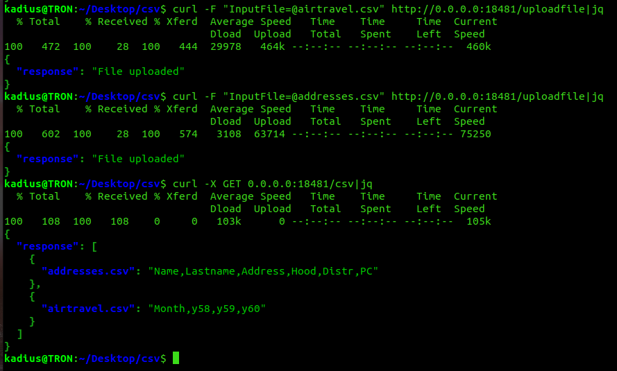

# cpp-crud-rest-api-experiments

## Docker deployment
Run the following commands:

+ git clone --recursive --remote  https://github.com/KadiusLunarflame/cpp-crud-rest-api-experiments 

Inside project directory:<br>
+ docker-compose build && docker-compose up<br>

These run a csv-processing server on port 18481 and a postgre db server that the csv-server works with.

## API
API allows performing simple select queries with conditions and ordering(WHERE and ORDER BY clauses).
API uses JSONs for communication.


* Upload file to server

To upload a file to server one must send a json object message containing the file.<br>

Example: <br>

Via curl: curl -F "InputFile=@<<i>filename></i>" http://0.0.0.0:18481/uploadfile <br>


* Delete file from server<br>
JSON format:
```json
{
  "filename":"filename.csv"
}
```


* Get all filenames and their headers



* Retrieve columns ("select" operation)<br>
JSON structure:
```json
{
  "filename":"filename.csv",
  "operation": "select",
  "select_col_names": "col1,col2,col3,..."
}
```


* Retrieve columns with filtering conditions ("select where" operation)<br>
JSON structure("condition" field is in sql-compatible format):
```json
{
  "filename":"filename.csv",
  "operation": "select where",
  "select_col_names": "col1,col2,col3,...",
  "conditions": "col1 < 100..."
}
```


* Retrieve columns in specific order
```json
{
  "filename":"filename.csv",
  "operation": "select order",
  "select_col_names": "col1,col2,col3,...",
  "order": "col1 [asc/desc], col2 [asc/desc], ..."
}
```


* Retrieve columns with filtering conditions and ordering ("select where order" operation)<br>
  JSON structure("condition" field is in sql-compatible format):
```json
{
  "filename":"filename.csv",
  "operation": "select",
  "select_col_names": "col1,col2,col3,...",
  "conditions": "col1 < 100...",
  "order":"col1 [asc/desc], col2 [asc, desc], ..."
}
```


